# System Testing & QA Evidence

## Purpose
This document records system-level testing for the Small Business Directory application and provides a regression checklist with captured evidence.

## Environments
- Azure: http://20.199.16.127 or http://smallbusinessdirectory.francecentral.cloudapp.azure.com
- Local: http://localhost:5173 (frontend) + http://localhost:3000 (backend)

## Evidence Location
Screenshots are stored in [docs/src](docs/src). Each screenshot is embedded below with a short explanation of what it proves.

---

## System Test Evidence (End-to-End)

### ST-01: Browse Approved Listings
**Preconditions**: At least one listing with status=active in the database.

**What we are testing**:
Public browse page only shows approved listings and filters narrow results correctly; listing detail exposes core metadata.

**Expected result**:
Active listings only; filters reduce visible results; detail view shows vendor contact details, categories, and optional image/opening hours.

**Evidence**:
ST-01-01 proves multiple active listings render with title/city/category metadata.
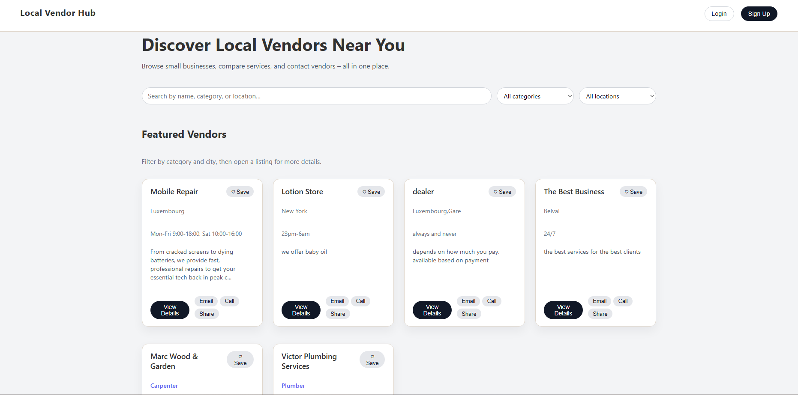

ST-01-02 proves the city filter updates reduces the result set.
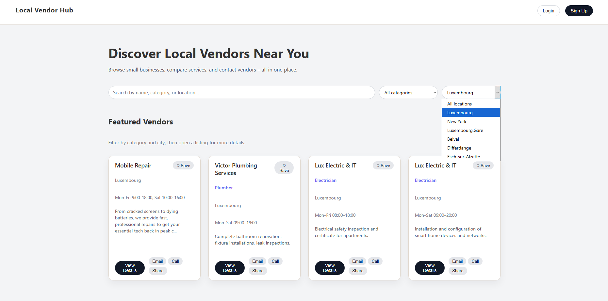

ST-01-03 proves the detail page exposes listing title, description, categories, and contact info.
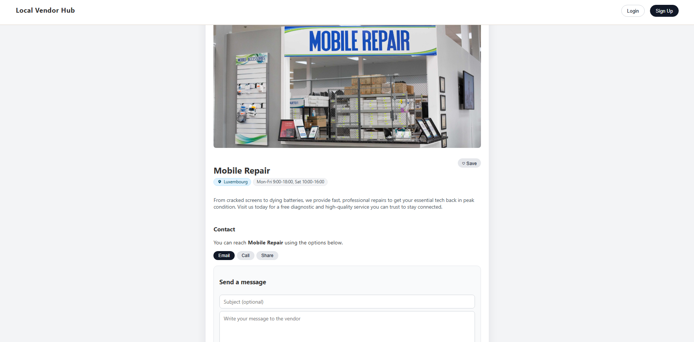

---

### ST-02: Signup & Login
**Preconditions**: None.

**What we are testing**:
User registration creates an account; login issues a JWT token; profile view shows stored user data.

**Expected result**:
Signup succeeds; login returns a token; profile page displays the correct email, name, and role; token is persisted in browser storage.

**Evidence**:
ST-02-01 proves registration fields are filled and validation requirements are met before submit.
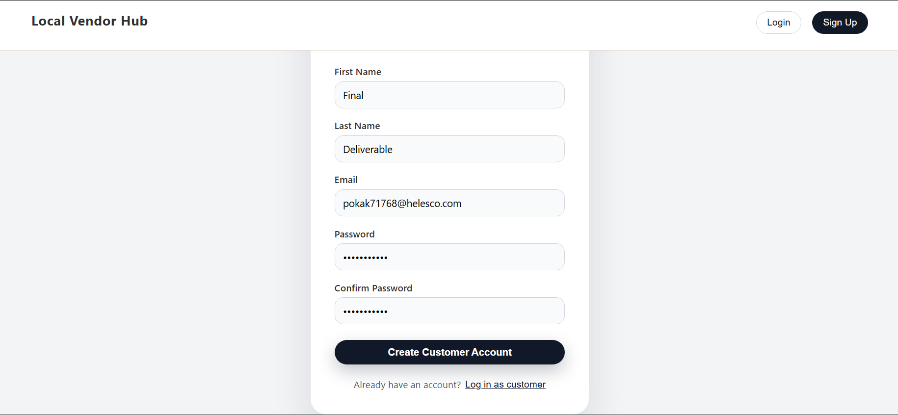

ST-02-02 proves the registration request succeeds in the network tab and returns a token.
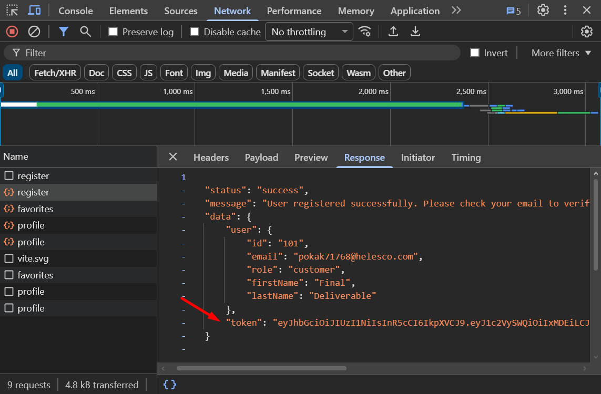

ST-02-03 proves the customer dashboard loads and the account is marked as not yet verified.
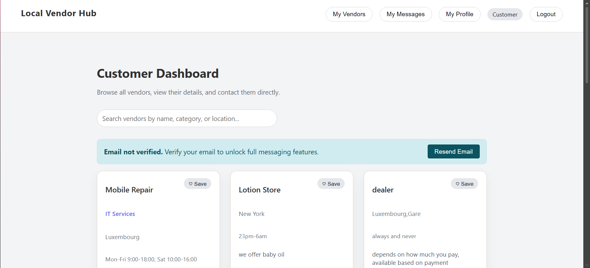

ST-02-04 proves the verification email is received.
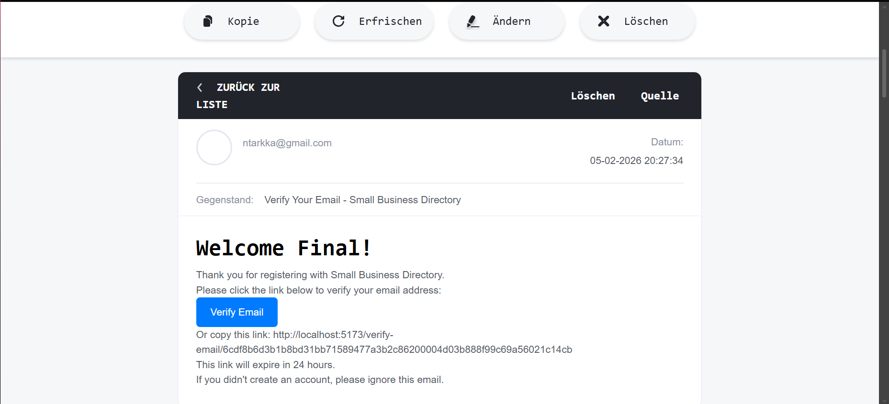

ST-02-05 proves the account is verified after email confirmation.
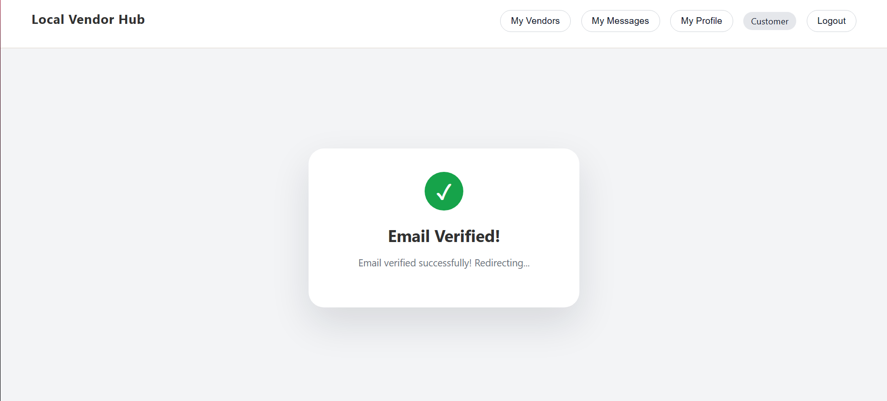

---

### ST-03: Vendor Create Draft -> Submit
**Preconditions**: Vendor account exists (registered with business name and city).

**What we are testing**:
Vendors can create a listing; the API returns a created listing with draft or submitted status; the listing appears in the vendor dashboard.

**Expected result**:
Listing is created with status=draft or submitted and is visible in the vendor listings table.

**Evidence**:
ST-03-01 proves the listing creation form captures all required input fields.
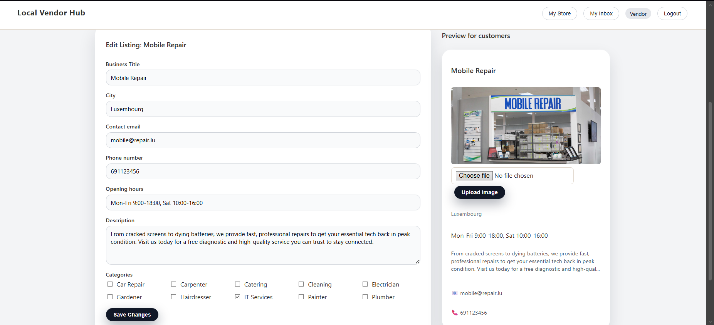

ST-03-02 proves the POST /api/listings request succeeds with status 201 and includes the new listing status.
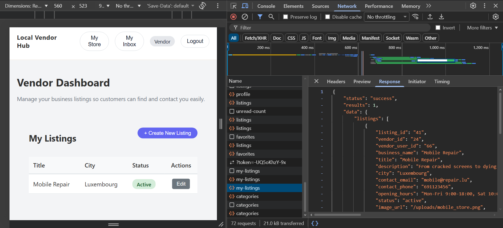

ST-03-03 proves the new listing appears in the vendor dashboard with a status badge.
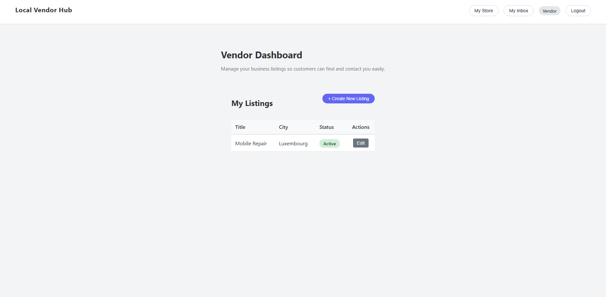

---

### ST-04: Admin Approve -> Listing Goes Public
**Preconditions**: Admin account exists; at least one listing is submitted/pending.

**What we are testing**:
Admins can approve listings; approval updates listing status to active; approved listings become visible to the public.

**Expected result**:
Listing status changes to active and the listing appears on the public browse page.

**Evidence**:
ST-04-01 proves the admin queue shows pending listings with status badges.
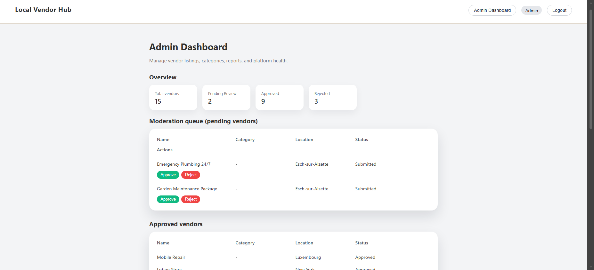

ST-04-02 proves the approval action is recorded (PATCH request or confirmation modal).
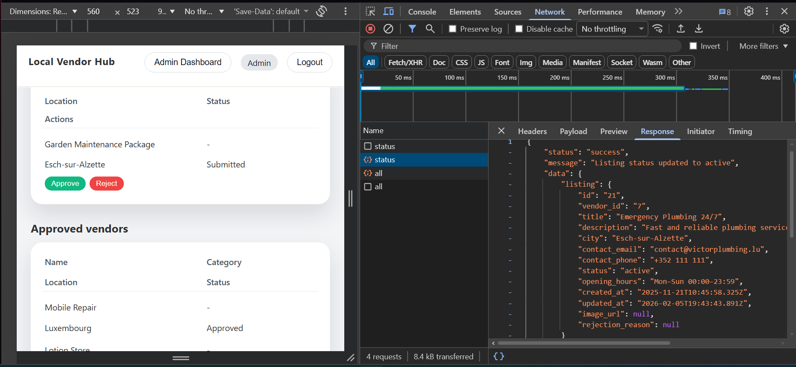

ST-04-03 proves the listing status changes to active in the admin view.
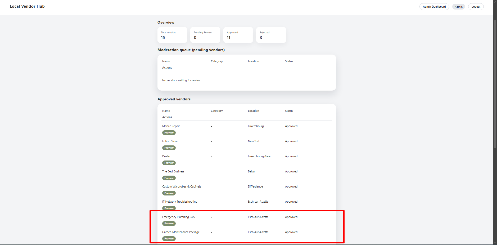

ST-04-04 proves the approved listing is visible on the public browse page.
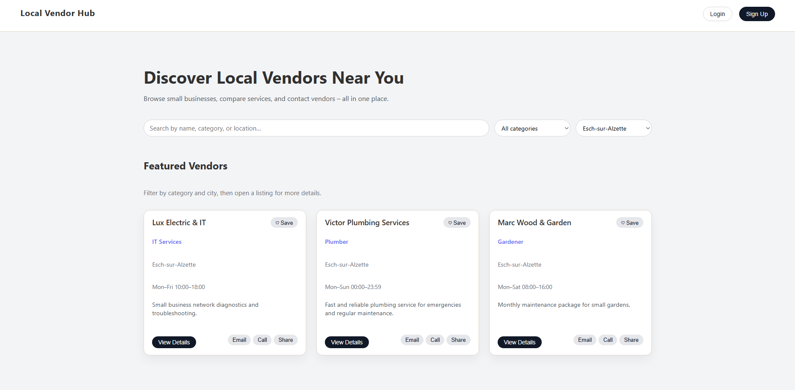

---

### ST-05: Messaging + Privacy Enforcement
**Preconditions**: Customer and vendor accounts exist; at least one active listing exists.

**What we are testing**:
Customers can send messages to vendors; vendors receive messages; only participants can view a message thread; third parties are blocked.

**Expected result**:
Message appears in vendor inbox and detail view; third-party access returns 401 Forbidden.

**Evidence**:
ST-05-01 proves the message form captures subject/content and listing selection.
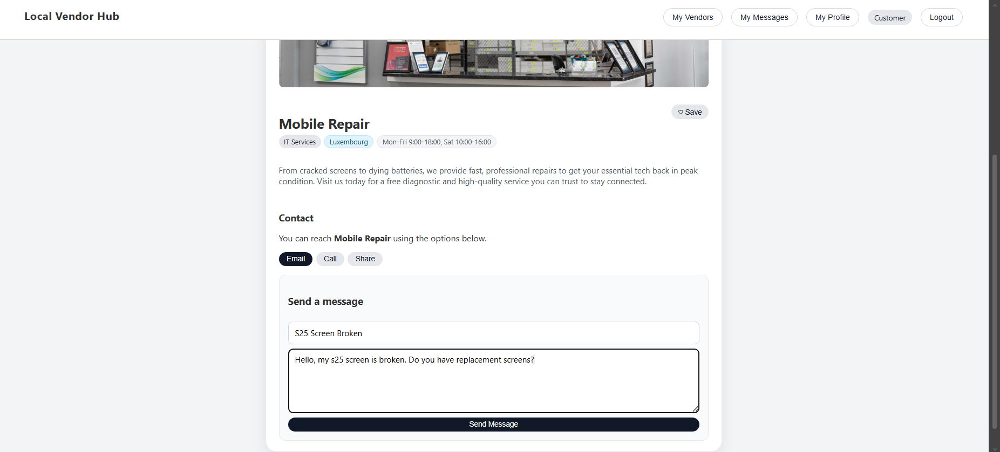

ST-05-02 proves the vendor inbox lists the received message with sender and timestamp.
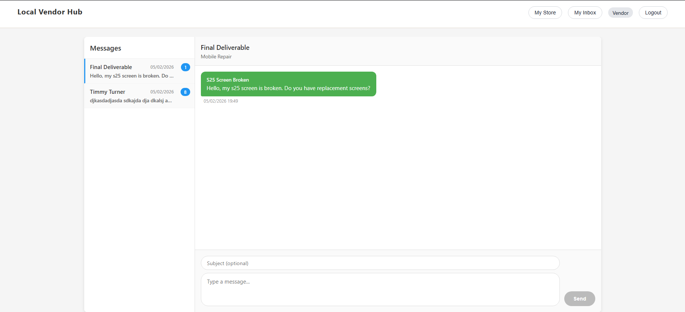

ST-05-03 proves third-party access to the message is denied.
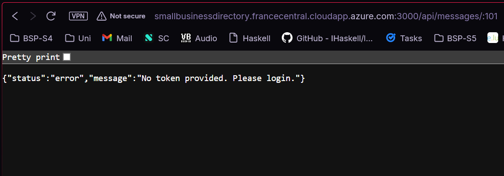

---

### ST-06: Rate Limiting Triggers
**Preconditions**: Any authenticated account.

**What we are testing**:
Message rate limiting enforces a maximum of 5 messages per minute per user.

**Expected result**:
First 5 requests succeed; the 6th returns 429 Too Many Requests with retry headers.

**Evidence**:
ST-06-01 proves five successful requests (201) and the sixth denied with 429 Too Many Requests.
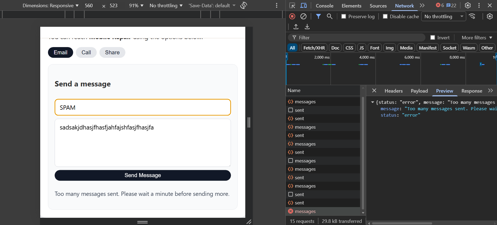

---

## Regression Checklist

**Core flows:**
- [ ] Public listings browse + filters
- [ ] Listing detail renders images + metadata
- [ ] Signup (customer/vendor) + login + profile
- [ ] Vendor listing creation + update + delete
- [ ] Admin approval workflow
- [ ] Messaging send + inbox + privacy enforcement
- [ ] Favorites add/remove
- [ ] Rate limiting on auth/listings/messages

**Security and quality:**
- [ ] JWT expiry handled (401 on expired token)
- [ ] Validation errors return 400 with messages
- [ ] No sensitive data logged in responses
- [ ] CI green on main
